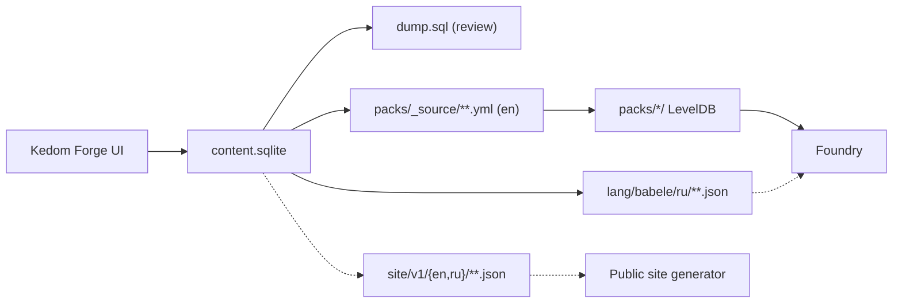

# Compendium pipeline

How authored content becomes a compendium pack. One direction, no round trip.

## The chain



**SQLite is the source of truth.** Everything downstream is generated
([ADR-011](../research/05-decisions.md#adr-011--sqlite-is-the-content-source-of-truth-yaml-is-the-reviewable-artefact)).

The dashed branches are designed but not built. The site generator is
[../forge/public-site-export.md](../forge/public-site-export.md); Babele overlays and the
English-canonical / Russian-overlay split are [../forge/localisation.md](../forge/localisation.md).
Both are consumers of the same slugs, which is why identity has to be stable outside Foundry.

## Why each stage exists

**SQLite**, because the authoring workflow is relational. "This region has these races; each
race has these backgrounds; each background offers these skills to choose from" is a foreign
key graph, and expressing it in flat YAML means maintaining referential integrity by hand.
See [../forge/schema.md](../forge/schema.md).

**dump.sql**, because SQLite is binary and a binary file in a pull request tells you nothing.
`npm run forge:dump` writes a deterministic SQL dump so content changes are reviewable. This is
the lesson from mothership, which commits binary LevelDB packs and consequently cannot diff
its own content.

**YAML**, because it is what the compendium tooling consumes and what a human can read in a
diff. dnd5e ships 4,871 YAML pack sources for exactly this reason.

**LevelDB**, because that is what Foundry reads. Generated, gitignored, never edited.

## One-way, and why

Content flows from SQLite outward and never back.

The alternative — editing YAML or editing in Foundry and importing back — creates a merge
problem with no good answer. Two sources of truth for the same record means reconciling them,
and reconciling them means either a diff UI or arbitrary conflict rules. Neither is worth
building for a single-author project.

**So: do not hand-edit `packs/_source/`.** Edit in Forge and re-export. The generated YAML
carries a header saying so.

`npm run packs:extract` exists, but only as a diagnostic — it dumps a compiled pack back to YAML
so you can see what Foundry actually stored. Its output is not an input.

### The consequence to accept

Content edited *inside* Foundry — a GM tweaking an item in a world — is not captured. That is
correct: a world is play state, not source. But it means the authoring loop is
"Forge → export → build → reload", not "edit in Foundry → save". The loop is fast enough
because hot reload picks up pack changes without restarting.

## Commands

```sh
npm run forge:dump      # sqlite -> packages/content/dump.sql
                     # (export to YAML is triggered from the Forge UI or its CLI)
npm run packs:build     # packs/_source/**.yml -> packs/*/ LevelDB
npm run packs:extract   # packs/*/ -> YAML, for inspection only
```

`tools/pack.ts` and `tools/unpack.ts` wrap `@foundryvtt/foundryvtt-cli`, in the shape of
draw-steel's `tools/pullJSONtoLDB.mjs` and `tools/pushLDBtoJSON.mjs`.

## Pack layout

```
packages/system/packs/
  _source/                  committed YAML
    skills/
    origins/                races, backgrounds, classes
    conditions/             Active Effect documents
    injuries/               the critical-injury tables
    gear/
    journals/               setting text from the vault
  skills/                   generated LevelDB, gitignored
  ...
```

Declared in `system.json` under `packs[]` with `packFolders[]` for sidebar grouping. The array
is currently empty — packs get declared as content is authored, since a declared pack with no
LevelDB directory is a load error.

## Conditions and injuries are content

Worth stating plainly because it is the largest single content decision: the condition set
from [../rules/40-combat.md](../rules/40-combat.md) and the whole critical-injury system from
[../rules/80-criticals.md](../rules/80-criticals.md) ship as **Active Effect documents in
compendiums**, not as code.

v14 makes this practical — Active Effects are primary documents that live in packs, drag onto
actors and tokens, modify token data, and expire on duration events. A group IV head injury is
an effect with a duration and a change list.

The system implements a **lookup** from `(severity, location, weaponType)` to a pack entry.
It does not implement an injury engine
([ADR-009](../research/05-decisions.md#adr-009--declarative-effects-and-a-handler-registry-no-user-authored-javascript)).

## Determinism

Generated artefacts must be byte-stable, or every export produces a spurious diff.

- YAML keys sorted, indent fixed, UTF-8, LF endings.
- Document `_id`s are **stable and stored in SQLite**, never regenerated. A regenerated `_id`
  breaks every reference to that document in every existing world.
- `dump.sql` rows ordered by primary key.
- No timestamps in generated output.

Stable IDs are the same principle as stable slugs in
[data-model.md](data-model.md#skills-and-specialisations): identity is assigned once and never
changes, and everything human-readable is a separate mutable field.

## Reproducibility

The whole chain must run from a fresh clone. This is a direct response to
`foundryvtt-wwn`, whose fourteen `generate:*` scripts all point at an `/import-scripts/`
directory that is gitignored — so its packs cannot be rebuilt by anyone but its author.

`packages/content/content.sqlite` and `dump.sql` are therefore **committed**, and the
migrations that build the schema live in `packages/forge/api/migrations/`.
