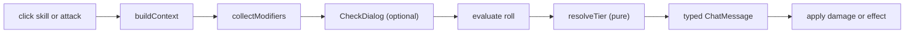

# Roll pipeline

How a click becomes a result. This is the answer to "modular, functional, without abstraction
for its own sake" — one linear flow through independent pure functions.

## The flow



Six stages, each a function. Nothing subclasses anything.

## Stage 1 — build context

A click produces a plain `RollContext`: who is rolling, what with, against what.

```
RollContext:
  actor         KedomActor
  kind          "check" | "attack" | "damage" | "save"
  skillSlug?    SkillSlug
  specSlug?     SpecializationSlug
  weapon?       KedomItem
  target?       KedomToken
  difficulty?   ProficiencyTier
```

This is data, not an object with behaviour. Everything downstream reads it and returns new
data.

## Stage 2 — collect modifiers

**The core design decision.** Modifiers come from independent collector functions, each
taking the context and returning `Modifier[]`:

```
type Modifier = {
  label: string        // localised, shown on the chat card
  value: number
  source: {           // retained for chat / UI attribution (ADR-006)
    id: string         // stable key or document uuid
    label: string      // human-readable origin
  }
  kind: "ability" | "skill" | "specialization" | "armor" | "effect" | "situational"
}

type ModifierCollector = (ctx: RollContext) => Modifier[]
```

```
src/rolls/collectors/
  ability.ts          the governing attribute's modifier
  skill-level.ts      skill level, or -1 untrained
  specialization.ts   full level with a specialisation, level/2 without
  armor-penalty.ts    armour's skill penalty
  weapon.ts           weapon attack bonus
  effects.ts          Active Effect contributions
  situational.ts      whatever the player typed in the dialog
```

Adding a rule means **adding one file and one line to a list**. It does not mean subclassing a
framework, registering a priority, or learning a predicate language.

### Why not a rules engine

pf2e has 40 `RuleElement` classes, a 25-collection `synthetics` bucket, and a predicate
engine over stringly-typed roll options — "a framework inside a system", where every feature
becomes an unchecked string. dnd5e's Activities mixin is ~1,400 lines for twelve activity
types. Both are appropriate to their scale and neither is affordable against a 7,000-line
budget ([ADR-006](../research/05-decisions.md#adr-006--modifier-collectors-with-retained-source-no-rules-engine)).

The cost of the simple version: a modifier that depends on complex conditions has to be
either an Active Effect (the normal case) or a named handler in a small registry. It cannot be
expressed as content-authored data. That is an accepted limit, not an oversight
([ADR-009](../research/05-decisions.md#adr-009--declarative-effects-and-a-handler-registry-no-user-authored-javascript)).

### Ordering

Collectors run in a fixed declared order so the chat card reads consistently. They do **not**
have priorities, and no collector may depend on another's output — if two ever need to
interact, that is one collector, not two with an ordering contract.

## Stage 3 — the dialog

Optional, skippable with a modifier key, in the shape of dnd5e's
`buildConfigure`/`buildEvaluate`/`buildPost` split. It shows the collected modifiers, accepts
a situational modifier and a difficulty, and returns an updated context. It is an
ApplicationV2 dialog and it computes nothing.

## Stage 4 — evaluate

Sum the modifiers, build the formula, evaluate the `Roll`.

The dice expression comes from `src/config/`, **not from a constant in this code**, so a later
revision stays cheap. The settled defaults are:

- skills and saves: `2d10 + attribute + proficiency`
- attacks: `1d20 + attribute + proficiency`

with the success ladder in [../rules/20-skills.md](../rules/20-skills.md)
([Q1 resolved](../rules/99-open-questions.md#q1--the-core-dice-mechanic--settled-for-now)).
The expression is per-check-type, not global.

## Stage 5 — resolve the outcome (deferred detail)

**ADR-008 is deferred:** implement banding once sourced modifiers and chat breakdowns work.
Until then, evaluate the roll total and show the modifier list; mapping onto
`failure | cost | success` can call a thin config-driven helper when ready.

Intended shape (not binding yet):

```
resolveOutcome(input: {
  total: number
  difficulty: ProficiencyTier
  thresholds: OutcomeThresholds  // from config
}): {
  outcome: "failure" | "cost" | "success"
  margin: number
}
```

The rules ladder is in [../rules/20-skills.md](../rules/20-skills.md) — three outcomes, no
skill critical success
([Q6](../rules/99-open-questions.md#q6--critical-success-versus-the-legendary-tier--critical-success-removed)).
Critical **injuries** ([../rules/80-criticals.md](../rules/80-criticals.md)) are a separate
combat subsystem.

Keep outcome maths pure and Foundry-free so it is unit-testable when written. Do not copy
WFRP4e's ~200-line `computeResult()` kitchen sink.

## Stage 6 — the chat card

A typed `ChatMessage` DataModel — `check`, `attack`, or `damage` — persisting the full
modifier list with **labels and sources**, the total, and (when banding exists) the outcome.

Persisting sourced modifiers means the card can explain itself without recomputing:

```
14 = 9 (2d10) + 2 (Focus) + 2 (Trained, Survive)
Success at a Cost
```

It also means the card stays interactive later — spend luck, re-roll, apply damage — which is
how CoC7 makes push-rolls work, but with a schema instead of an untyped flag bag.

Card interaction uses **one delegated listener dispatching on `data-action`**, following
pf2e's `ChatCards.listen()`, rather than per-card wiring.

## Stage 7 — apply

Damage application reads the card, computes hit points, wounds, and System Strain, and writes
one update.

Deliberately simple. pf2e calls `getContextualClone()` per target per damage click — cloning
the actor with ephemeral effects and re-running full preparation — to resolve immunity,
weakness, and resistance exactly. That is correct for pf2e's rules and unnecessary here, where
damage is arithmetic ([ADR-006](../research/05-decisions.md#adr-006--modifier-collectors-with-retained-source-no-rules-engine)).

Wounds and Strain interact through the rules in
[../rules/50-wounds-strain.md](../rules/50-wounds-strain.md): healing a wound costs one System
Strain, and `wounded` is derived from wound count, never set directly.

## Advantage and disadvantage

The critical-injury tables use flat modifiers and advantage/disadvantage, sometimes in the same
entry. So the pipeline carries both: `Modifier[]` for the numbers, and a separate
`AdvantageState` on the context resolved to `-1 | 0 | +1` before the formula is built, with
sources listed on the card.

## Error handling at the boundary

Per the three-tier assertion rule in [../../Style.md](../../Style.md):

- **Collectors are pure logic.** They assert their preconditions and may
  throw on genuine programmer error. Outcome helpers, when written, the same.
- **The click handler is a boundary.** It never crashes the host. It catches, logs, and shows
  a notification, because an exception escaping a click handler leaves the player with a dead
  sheet and no explanation.

## Test plan

Collectors and other pure helpers get Vitest coverage from the start — numbers in, numbers
out ([ADR-014](../research/05-decisions.md#adr-014--unit-tests-only-no-playwright-e2e-for-now)).
Outcome banding tests land with ADR-008 when that work is un-deferred.

No Playwright e2e requirement for now.
